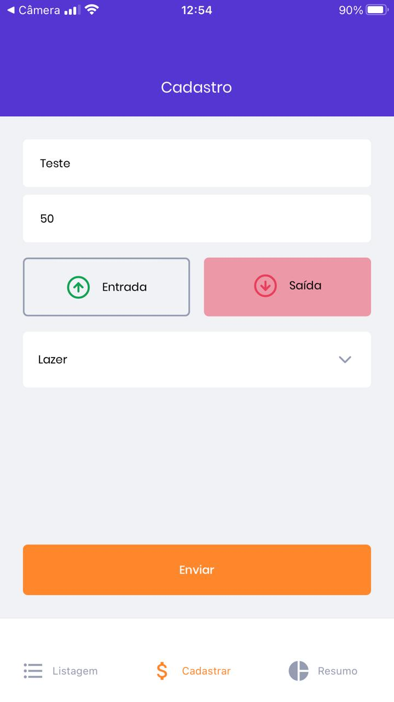
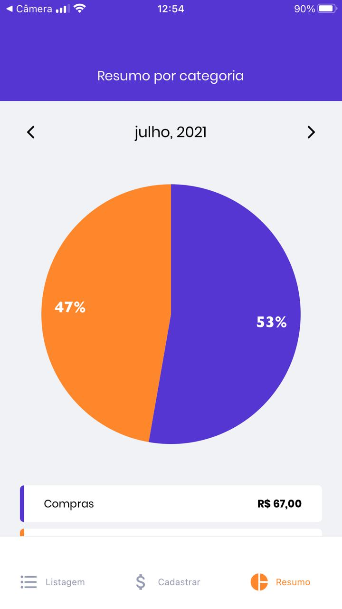

<h1 align="center">
  
</h1>

<div align="center">
      
    <a href="https://www.linkedin.com/in/whuanderson-de-sousa-porto-marinho-a07204216//" target="_blank" rel="Whuanderson">
      
    </a>
       
</div>
 
<div align="center">
  
   
   
   
</div>
  
 <p align="center">
  :rocket: Aplicativo de finanças criado com as aulas do ignite da @rocketseat
 </p>
  
<div align="center">
  <sub>O Projeto. Feito por:
    <a href="https://github.com/Whuanderson">Whuanderson Marinho</a>
  </sub>
</div>

# 🚀 Tecnologias

  - [Expo](https://expo.io/)
  - [React Native](https://reactnative.dev/)
  - [TypeScript](https://www.typescriptlang.org/)
  
  ## 💻 Começando

### Requerimentos

- [Expo](https://expo.io/)
- [Yarn](https://classic.yarnpkg.com/) or [NPM](https://www.npmjs.com/)

### 📱  Instalando e executando o projeto

*Clone o projeto e acesse a pasta*

```bash
$ git clone https://github.com/Whuanderson/GoFinances
$ cd GoFinances
```
*Siga os passos abaixo:*

```bash
# Instale as dependências
$ Expo install


# Execute em um terminal :)
$ Expo start


# Muito bem, GoFinances é iniciado!

# Depois rode em um emulador. Ou Leia o QRcode com um celular!
$ Yarn run android
```
# :closed_book: Licença

Lançado em 2021 :closed_book: Licença

Feito por [Whuanderson Marinho](https://github.com/Whuanderson) 🚀.
Esse projeto está sobre [MIT license](./LICENSE).
